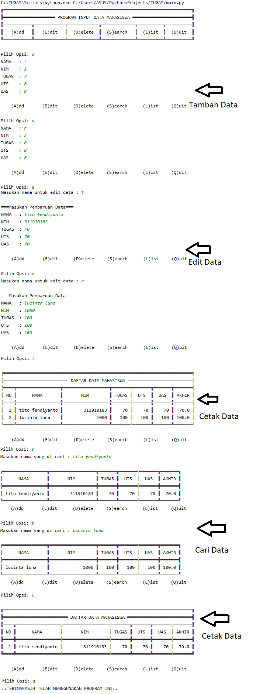

# Program 6

1.daftar_nilai.py berisi modul untuk:
* tambah_data 
* ubah_data 
* hapus_data
* cari_data

2.view_nilai.py berisi modul untuk:
* cetak_daftar_nilai 
* cetak_hasil_pencarian

3.input_nilai.py berisi modul untuk: input_data
yang meminta pengguna memasukkan data. 

4.main.py berisi program utama (Untuk memanggil semua fungsi yang ada)

Screenshot

